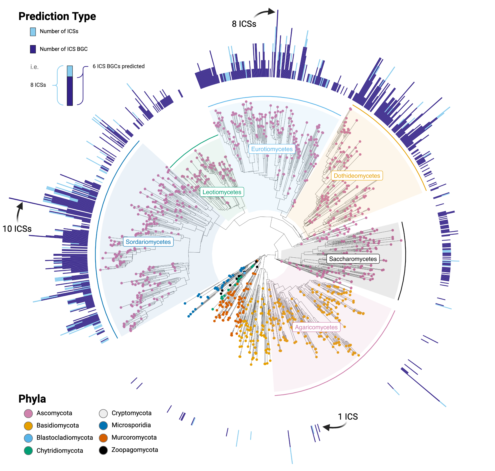

# Background

*Reminder of limitations!*

| Service Level | Pricing and Resources                                        |
| :------------ | :----------------------------------------------------------- |
| Bronze        | Free — 5GB quota and no scripting (i.e., static content); HTML-only. Includes one production domain. |

https://it.wisc.edu/services/web-hosting/

While obviously having a legit website with a wisconsin domain is ideal...

if you realize that html only is going to make this near impossible and force you to jump through tons of uneccessary hoops, we can always publish the html with the publication, and ask users to download and run it locally. I think that's better than nothing! 

**This is the small html website I found from a student class project. if you click around his site I would want something! Feel free to start from scratch or steal his or other website's code that you find. No point in re-inventing the wheel: **

[I saved one of his search html only tables in the GitHub repo](./websiteExample.html)

- confirm that I'm correct in saying it's html only before using! His blog says he also uses CSS and JS. Does that violate the html only requirement? I have a sinking feeling it does...
- I'm currently emailing the doIT with this exact question, will update this document when I get more information

*Other links to his project that may or may not be useful*

https://micahlindley.com/renart/

https://dev.to/micahlt/writing-a-searchable-database-with-pure-html-css-and-js-15cg

https://github.com/micahlt/renart

# Homepage 

Top of the website would say: "Isocyanide synthase biosynthetic gene clusters in the Fungal Kingdom"

- I might make this as a nice png infographic as it will be easier to make look professional with colors, text sizes, etc. Then you would just need to place that png on the top of the html

The homepage then needs to display two options

1. Search by species/accesion 
   - higher priority

2. search by gene cluster family (GCF)
   - only worry about after you get the first step working

And below those simple buttons I'd like you to place this png (linked to location in repository). It's a main figure from the publication and would make the page look not so empty:

When the user then clicks on one of those links, it should take them to a seperate subpage, which I'll describe below.

# Species/accession search

### Database searchable page

[TSV table storing all the data you need](./Data/SupTable3.tsv)

It has a column for species, the accession, and number or predicted ICS BGCs

- The only irrelevant columns is titled 'Number_of_ICS', ignore this
- You want to use the data from the "Number_of_ICS_BGCs" column

I made this crappy edit on the RenArt search page to explain exactly what I'm thinking it would look like:

___

### Subpages for each accession

As we discussed, each accession *ideally* would have a visualization of each cluster. And allow you to highlight over the cluster genes to see what the gene name, protein name, and protein domains are within it.

The data that contains the protein names, and domains, can all be found in [Sup Table 4](./Data/SupTable4.tsv)

I have some other tables that you'll probably need to display the genes themselves (i.e. where to plot them), but I figured we'll cross that bridge once you get to this stage. I'll probably have to reorganize several tables in a way that makes it super easy for you to automate this plotting.

I was trying to dig throught the GitHub of the program that does this plotting, and I think he did so with javascript. But again the output of this "i think" is just an html.  So I'm guessing he uses the JS to produce the HTML? 

Probably best for us to go through the repo together. I know the program and what it produces, but have a harder time deciphering what it is doing what in his code.

https://github.com/gamcil/clinker/blob/392613f5f6ac74e2a16035fb6a0c27858b50d898/clinker/plot/clinker.js

