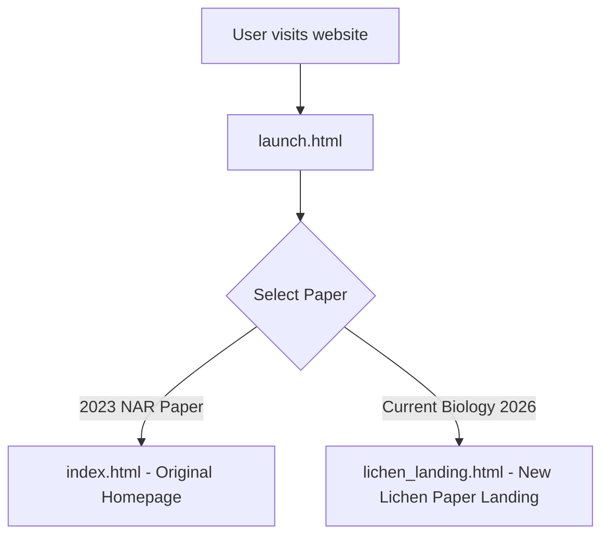

# FungalICS Website Update Plan: Lichen Paper Features

## Overview

This plan outlines the implementation of new features to update the FungalICS website to include findings from the upcoming Current Biology paper on isocyanide BGCs in Lecanoromycetes (lichenized fungi).

## Current Website Analysis

### Existing Technology Stack
- **Framework**: Static HTML with Bootstrap 5.3
- **Styling**: Inline CSS with custom classes + Bootstrap components
- **JavaScript**: Vanilla JS for dynamic content loading
- **Fonts**: Nunito Sans (Google Fonts)

### Key Design Patterns Identified
- **Color Scheme**:
  - Primary green: `#295135` (headings, links)
  - Blue accent: `#173b71` (search links)
  - Medium blue: `#406E8E` (tips, buttons)
  - Dark blue: `#23395B` (button hover states)
  - Navbar: Bootstrap `bg-primary`
- **Button Styles**: `.button`, `.allButton` classes with rounded corners (15px), shadow effects, and hover transitions
- **Layout**: Centered text alignment, Bootstrap grid system
- **Interactive Elements**: Bootstrap modals, offcanvas panels, collapsible sections

### Existing File Structure
```
/
├── index.html          (current homepage -> will become 2023 paper landing)
├── gcfs.html           (GCF viewer page)
├── gcf_search.html     (GCF search page)
├── species_accession.html
├── taxa_search.html
├── cblaster.html
├── bgcs.html
├── ImportantCaveats.html
├── Images/
├── Data/
│   ├── LichenPaper/
│   │   ├── crmA/
│   │   ├── LichenGroup1/
│   │   ├── LichenGroup2/
│   │   ├── LichenGroup3/
│   │   └── LichenGroup4/
│   └── ... (existing data)
```

---

## Feature Implementation Plan

### Feature 1: New Launch Page (Paper Selection)

**Purpose**: Create a new entry point that allows users to choose which publication's results they want to explore.

**File**: [`launch.html`](./launch.html) (NEW - becomes the main entry point)

**Implementation Details**:



**Design Specifications**:
- Centered layout with title: "Isocyanide Synthase Biosynthetic Gene Clusters in Fungi"
- Subtitle: "Select a publication to explore"
- Two large buttons side by side:
  1. "2023 NAR Paper: Mining for a New Class of Fungal Natural Products" → links to `index.html`
  2. "2026 Current Biology (in press): ICS BGCs in Lichenized Fungi" → links to `lichen_landing.html`
- Match existing font and color scheme
- Include brief description under each button

**Styling**: Reuse existing `.allButton` class, adjust size for larger presentation

---

### Feature 2: Pop-up Navigation Button

**Purpose**: Allow users to quickly switch between paper sections from any page.

**Implementation**: Add to all pages EXCEPT `launch.html`

**Components**:
1. Fixed position button in top-right corner
2. Bootstrap modal or offcanvas with two navigation options

**Design**:
```html
<!-- Pop-up trigger button - positioned top-right -->
<button class="paper-nav-btn" data-bs-toggle="modal" data-bs-target="#paperNavModal">
  📚 Switch Paper
</button>

<!-- Modal content -->
<div class="modal" id="paperNavModal">
  <button>Go to 2023 ICS BGC paper</button>
  <button>Go to updated lichen and crmA ICS BGC paper</button>
</div>
```

**Styling**:
```css
.paper-nav-btn {
  position: fixed;
  top: 10px;
  right: 10px;
  z-index: 1000;
  background-color: #406E8E;
  color: white;
  border-radius: 15px;
  padding: 10px 15px;
}
```

**Files to Modify**:
- [`index.html`](./index.html)
- [`gcfs.html`](./gcfs.html)
- [`gcf_search.html`](./gcf_search.html)
- [`species_accession.html`](./species_accession.html)
- [`taxa_search.html`](./taxa_search.html)
- [`cblaster.html`](./cblaster.html)
- [`bgcs.html`](./bgcs.html)
- [`ImportantCaveats.html`](./ImportantCaveats.html)
- All new lichen paper pages (except launch.html)

---

### Feature 3: crmA Warning Popup

**Purpose**: Alert users on crmA-related 2023 paper pages that the crmA species list has been updated.

**Target Pages**: Pages displaying crmA-related GCF content

**Implementation**:

**Visual Component**:
- Red warning button in top-right corner (below paper nav button)
- Text: "CLICK HERE IF LOOKING INTO crmA"
- On click: Opens Bootstrap modal

**Modal Content**:
1. Warning text explaining outdated crmA information
2. Embedded image: [`Data/LichenPaper/crmA/CrmDistribution.png`](./Data/LichenPaper/crmA/CrmDistribution.png)
3. Caption: "Supplemental Fig. 5 from Nickles et al. (2026)..."
4. Link to new crmA page: `lichen_crma.html`

**Styling**:
```css
.crma-warning-btn {
  position: fixed;
  top: 60px;
  right: 10px;
  z-index: 999;
  background-color: #dc3545; /* Bootstrap danger red */
  color: white;
  animation: pulse 2s infinite;
}
```

---

### Feature 4: New Lichen Paper Pages

#### 4.1 Lichen Paper Landing Page

**File**: [`lichen_landing.html`](./lichen_landing.html) (NEW)

**Title**: "Isocyanide Synthase (ICS) Biosynthetic Gene Clusters (BGCs) heavily associated with lichenized fungi"

**Layout**:
```
┌─────────────────────────────────────────────────┐
│ [Paper Nav Button]              [Switch Paper]  │
├─────────────────────────────────────────────────┤
│                                                 │
│          Title (centered, green)                │
│          Subtitle: 2026 Current Biology         │
│                                                 │
│    ┌─────┐  ┌─────┐  ┌─────┐  ┌─────┐  ┌─────┐ │
│    │LFF1 │  │LFF2 │  │LFF3 │  │LFF4 │  │crmA │ │
│    └─────┘  └─────┘  └─────┘  └─────┘  └─────┘ │
│                                                 │
│     Brief description of the paper findings     │
│                                                 │
└─────────────────────────────────────────────────┘
```

**Buttons**: Link to respective subpages:
- LFF1 → `lichen_lff1.html`
- LFF2 → `lichen_lff2.html`
- LFF3 → `lichen_lff3.html`
- LFF4 → `lichen_lff4.html`
- crmA → `lichen_crma.html`

---

#### 4.2-4.5 LFF Subpages (LFF1, LFF2, LFF3, LFF4)

**Files**: 
- [`lichen_lff1.html`](./lichen_lff1.html)
- [`lichen_lff2.html`](./lichen_lff2.html)
- [`lichen_lff3.html`](./lichen_lff3.html)
- [`lichen_lff4.html`](./lichen_lff4.html)

**Common Structure**:

```
┌─────────────────────────────────────────────────┐
│ [Home] [LFF1] [LFF2] [LFF3] [LFF4] [crmA]      │
├─────────────────────────────────────────────────┤
│                                                 │
│          Title: LFF[N] ICS BGC Cluster          │
│                                                 │
│    ┌────────────────────────────────────────┐   │
│    │     SVG Tree Image (embedded)         │   │
│    └────────────────────────────────────────┘   │
│                                                 │
│    [Download GBK Files Button]                  │
│                                                 │
│    ▼ Clinker Alignment (collapsed by default)  │
│    ┌────────────────────────────────────────┐   │
│    │  iframe: clinker_lff[N].html          │   │
│    └────────────────────────────────────────┘   │
│                                                 │
│    ▼ CGCG Analysis (collapsed by default)      │
│    ┌────────────────────────────────────────┐   │
│    │  iframe: cgcg_lff[N].html             │   │
│    └────────────────────────────────────────┘   │
│                                                 │
└─────────────────────────────────────────────────┘
```

**Data Sources**:

| LFF | Tree SVG | Clinker HTML | CGCG HTML | GBK Directory |
|-----|----------|--------------|-----------|---------------|
| LFF1 | `Data/LichenPaper/LichenGroup1/lff1_Tree.svg` | `Data/LichenPaper/LichenGroup1/clinker_lff1.html` | `Data/LichenPaper/LichenGroup1/cgcg_lff1.html` | `Data/LichenPaper/LichenGroup1/*.gbk` |
| LFF2 | `Data/LichenPaper/LichenGroup2/lff2_Tree.svg` | `Data/LichenPaper/LichenGroup2/clinker_lff2.html` | `Data/LichenPaper/LichenGroup2/cgcg_lff2.html` | `Data/LichenPaper/LichenGroup2/*.gbk` |
| LFF3 | `Data/LichenPaper/LichenGroup3/lff3_Tree.svg` | `Data/LichenPaper/LichenGroup3/clinker_lff3.html` | `Data/LichenPaper/LichenGroup3/cgcg_lff3.html` | `Data/LichenPaper/LichenGroup3/*.gbk` |
| LFF4 | `Data/LichenPaper/LichenGroup4/lff4_Tree.svg` | `Data/LichenPaper/LichenGroup4/clinker_lff4.html` | `Data/LichenPaper/LichenGroup4/cgcg_lff4.html` | `Data/LichenPaper/LichenGroup4/*.gbk` |

**Collapsible Sections**: Use Bootstrap Accordion component for clinker and CGCG sections

**GBK Downloads**: Create zip files from gbk files in each LichenGroup directory:
- `Data/LichenPaper/LFF1_gbks.zip`
- `Data/LichenPaper/LFF2_gbks.zip`
- `Data/LichenPaper/LFF3_gbks.zip`
- `Data/LichenPaper/LFF4_gbks.zip`

---

#### 4.6 crmA Subpage

**File**: [`lichen_crma.html`](./lichen_crma.html) (NEW)

**Structure**:

```
┌─────────────────────────────────────────────────┐
│ [Home] [LFF1] [LFF2] [LFF3] [LFF4] [crmA]      │
├─────────────────────────────────────────────────┤
│                                                 │
│          Title: crmA ICS BGC Pathway            │
│                                                 │
│    ┌────────────────────────────────────────┐   │
│    │   FusariumMetabolites_pathwayOnly.png │   │
│    └────────────────────────────────────────┘   │
│    Caption: Fig. 3b from Nickles et al...       │
│                                                 │
│    ┌────────────────────────────────────────┐   │
│    │   ProposedEvolutionaryNRPSSteps.png   │   │
│    └────────────────────────────────────────┘   │
│    Caption: Fig. 5 from Nickles et al...        │
│                                                 │
│    ▼ crmA Species Table (collapsed)            │
│    ┌────────────────────────────────────────┐   │
│    │  TSV table rendered as HTML           │   │
│    └────────────────────────────────────────┘   │
│                                                 │
└─────────────────────────────────────────────────┘
```

**Images and Captions**:

1. **Image 1**: [`Data/LichenPaper/crmA/FusariumMetabolites_pathwayOnly.png`](./Data/LichenPaper/crmA/FusariumMetabolites_pathwayOnly.png)
   - Caption: "Fig. 3b from Nickles et al. (2026). Proposed fumicicolin A biosynthetic pathway, based in part on the proposed pinocicolin A pathway from Kishimoto et al. (2025)25 (recreated with permission) in addition to the findings from Chen et al. (2025)26."

2. **Image 2**: [`Data/LichenPaper/crmA/ProposedEvolutionaryNRPSSteps.png`](./Data/LichenPaper/crmA/ProposedEvolutionaryNRPSSteps.png)
   - Caption: "Fig. 5 from Nickles et al. (2026). Proposed evolutionary model for the CrmA metabolic pathway, with supporting structural alignments of CrmA domains..."

**TSV Table**: [`Data/LichenPaper/crmA/NRPS_CRM_FinalTable.tsv`](./Data/LichenPaper/crmA/NRPS_CRM_FinalTable.tsv)
- Load TSV via JavaScript fetch
- Render as Bootstrap table
- Table columns: Accession, Species, Lichen, crm_protein, crm_contig, crm_start, crm_end, etc.
- Implement search/filter functionality (optional enhancement)

---

## Shared Component: Navigation Bar for Lichen Pages

Create a reusable navigation component for all lichen paper pages:

```html
<nav class="navbar navbar-expand-lg bg-primary" data-bs-theme="dark">
  <div class="container-fluid nav-link_custom nav-link_header">
    <a class="nav-link" href="lichen_landing.html">
      
    </a>
    <ul class="navbar-nav">
      <li class="nav-item"><a class="nav-link" href="lichen_lff1.html">LFF1</a></li>
      <li class="nav-item"><a class="nav-link" href="lichen_lff2.html">LFF2</a></li>
      <li class="nav-item"><a class="nav-link" href="lichen_lff3.html">LFF3</a></li>
      <li class="nav-item"><a class="nav-link" href="lichen_lff4.html">LFF4</a></li>
      <li class="nav-item"><a class="nav-link" href="lichen_crma.html">crmA</a></li>
    </ul>
  </div>
</nav>
```

---

## New Files Summary

| File | Purpose |
|------|---------|
| `launch.html` | New main entry point with paper selection |
| `lichen_landing.html` | Lichen paper landing page with 5 buttons |
| `lichen_lff1.html` | LFF1 cluster details page |
| `lichen_lff2.html` | LFF2 cluster details page |
| `lichen_lff3.html` | LFF3 cluster details page |
| `lichen_lff4.html` | LFF4 cluster details page |
| `lichen_crma.html` | crmA pathway page |
| `Data/LichenPaper/LFF1_gbks.zip` | Downloadable GBK archive for LFF1 |
| `Data/LichenPaper/LFF2_gbks.zip` | Downloadable GBK archive for LFF2 |
| `Data/LichenPaper/LFF3_gbks.zip` | Downloadable GBK archive for LFF3 |
| `Data/LichenPaper/LFF4_gbks.zip` | Downloadable GBK archive for LFF4 |

---

## Files to Modify Summary

| File | Changes |
|------|---------|
| `index.html` | Add paper navigation popup (Feature 2) |
| `gcfs.html` | Add paper navigation popup (Feature 2) |
| `gcf_search.html` | Add paper navigation popup (Feature 2), Add crmA warning if applicable (Feature 3) |
| `species_accession.html` | Add paper navigation popup (Feature 2) |
| `taxa_search.html` | Add paper navigation popup (Feature 2) |
| `cblaster.html` | Add paper navigation popup (Feature 2), Add crmA warning if showing crmA data (Feature 3) |
| `bgcs.html` | Add paper navigation popup (Feature 2) |
| `ImportantCaveats.html` | Add paper navigation popup (Feature 2) |

---

## Implementation Order

1. **Phase 1: Core Infrastructure**
   - Create shared CSS styles file (optional, or keep inline)
   - Create GBK zip archives for each LFF group
   
2. **Phase 2: Launch Page**
   - Create `launch.html` with paper selection

3. **Phase 3: Lichen Paper Pages**
   - Create `lichen_landing.html`
   - Create `lichen_lff1.html` through `lichen_lff4.html`
   - Create `lichen_crma.html`

4. **Phase 4: Cross-Cutting Features**
   - Add paper navigation popup to all existing pages
   - Add crmA warning popup to relevant pages

5. **Phase 5: Testing**
   - Test all navigation paths
   - Verify embedded content loads correctly
   - Test downloads
   - Cross-browser testing

---

## Technical Considerations

### Embedded HTML (Clinker/CGCG)
The existing clinker and cgcg HTML files may have their own styling. Use iframes to isolate their styles:
```html
<iframe src="Data/LichenPaper/LichenGroup1/clinker_lff1.html" 
        style="width:100%; height:600px; border:none;"></iframe>
```

### SVG Tree Display
SVGs can be embedded directly or via img tag:
```html
<!-- Option 1: Direct embed for interactivity -->
<object data="Data/LichenPaper/LichenGroup1/lff1_Tree.svg" type="image/svg+xml"></object>

<!-- Option 2: Simple image embed -->

```

### TSV Table Loading
Use fetch API to load and parse TSV:
```javascript
async function loadTSVTable(filepath, tableId) {
  const response = await fetch(filepath);
  const text = await response.text();
  const rows = text.split('\n').map(row => row.split('\t'));
  // Build HTML table from rows
}
```

---

## Questions to Resolve Before Implementation

1. ~~Should the pop-up navigation appear on the new lichen paper pages as well?~~ **Yes**
2. ~~Which specific pages should show the crmA warning?~~ **Pages showing crmA-related content**
3. ~~Image correction for crmA page confirmed~~ **Yes, first image is FusariumMetabolites_pathwayOnly.png**
4. Should the launch page eventually replace the current index.html as the default landing page? (Consider URL structure)
5. Any specific styling preferences for the collapsible sections?

---

## Approval Checklist

- [ ] User approves overall plan structure
- [ ] User confirms file naming conventions
- [ ] User confirms navigation structure
- [ ] User confirms styling approach (reuse existing patterns)
- [ ] Ready for implementation in Code mode
